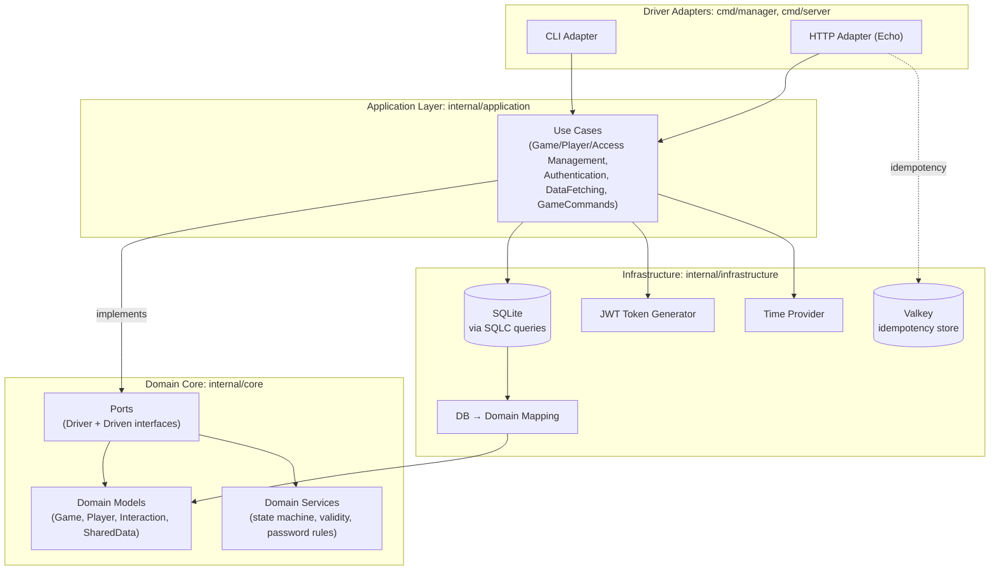

# Keep It Up

A system that coordinates periodic interactions across multiple devices and tracks when the next interaction is required.

> **Disclaimer:** this is **not** a game, nor was it built as one. The domain vocabulary (`games`, `players`, `save`, `pause`, `resume`) just happens to map cleanly onto a "keep something running before a deadline" mechanic, so those names were reused for clarity rather than invented from scratch.

## What it is

Keep It Up tracks whether a shared, multi-device entity (a "game") is still within its required interaction window, or whether it's lapsed. Any player with access to a game can:

- **save**: record an interaction that extends the current deadline by a given duration
- **pause**: freeze the deadline clock
- **resume**: unfreeze it, picking up where it left off

Access to a game isn't exclusive to one device: any number of players can be granted access to the same game, and any of them can act on it independently. The current state of a game (status, deadline, whether it's still valid) is never written directly, it's recomputed by replaying every interaction ever recorded for that game, in order. The interaction log is the source of truth; the current state is a view over it.

### Tech stack

| Layer | Choice |
|---|---|
| Language | Go 1.26 |
| HTTP framework | Echo v5 |
| Database | SQLite (via `modernc.org/sqlite`, pure-Go, no CGo) |
| Query generation | SQLC (typed queries from raw SQL) |
| Migrations | Goose |
| Idempotency store | Valkey |
| Auth | JWT (cookie-delivered) + bcrypt |

### Project structure



Use cases query SQLC directly, there's no repository interface layer, since there's exactly one persistence backend and no plan to change that. What *is* isolated is the domain vocabulary: `internal/core` never imports `internal/infrastructure`, so the state-machine and validation logic can be read, tested, and reasoned about without any database in the picture.

## Why it matters

Because access to a game is shared, more than one player (or the same player on more than one device) can act on the same game without coordinating with each other first. There's no single owner deciding what happens next, so the system itself has to be the one enforcing which transitions are even legal at a given moment: you can't pause a game that isn't playing, and you can't save one that's paused. If those rules lived only in client code, two independent devices could each end up acting on a different, incompatible idea of what state the game is in.

Keeping the full interaction history instead of a single mutable "current state" record also means:

- **The history is the audit trail, not an add-on.** Who saved, paused, or resumed a given game, and when, is the data model itself. There's nothing extra to build or keep in sync to answer that question.
- **Retried requests are safe by default.** Devices acting over networks that drop and reconnect are expected to retry mutating calls; every mutation accepts an `Idempotency-Key` so a retried `save` can't be double-counted.

## How to use it

### CLI (`cmd/manager`)

```text
keepitup <noun> <verb> [args...]

Nouns:
  game     add    <name>
           update <id> <name>
           delete <id>
  access   grant  <game id> <player id>
           revoke <game id> <player id>
           check  <game id> <player id>
  player   add          <name> <username> <password>
           rename       <id> <name>
           passwd       <username> <current password> <new password>
           passwd-force <username> <password>
           delete       <id>
  auth     validate-passwd <password>
           hash-passwd     <password>
           check-passwd    <username> <password>
  fetch    games        <player id>
           shared       <game id>
           interactions <game id> <limit> <offset>
  command  save   <game id> <player id> <duration in seconds>
           resume <game id> <player id>
           pause  <game id> <player id>
```

`keepitup help`, `-h`, or `--help` prints this at any time.

### HTTP API (`cmd/server`)

All routes are rooted at `/api`.

| Method | Path | Auth | Body / Params | Description |
|---|---|---|---|---|
| `POST` | `/api/login` | - | `username`, `password` | Sets a session cookie |
| `GET` | `/api/games` | cookie | - | List games the caller can access |
| `GET` | `/api/shared` | cookie | `gameId` | Current replayed state of a game |
| `GET` | `/api/interactions` | cookie | `gameId`, `query`, `limit`, `offset` | Interaction history (`query=all\|player\|first\|last`) |
| `POST` | `/api/save` | cookie | `gameId`, `duration` (seconds) | Record a save, extending the deadline |
| `POST` | `/api/play` | cookie | `gameId` | Resume a paused game |
| `POST` | `/api/pause` | cookie | `gameId` | Pause the game (deadline freezes) |

Cookie auth is a JWT issued by `/login`. `/save`, `/play`, and `/pause` accept an optional `Idempotency-Key` header: replaying the same key returns the original response instead of re-executing, and a key currently mid-flight returns `409 Conflict`.

## Installation

**Requirements:** a running [Valkey](https://valkey.io) instance (idempotency store). Go 1.26+ is only needed if building from source.

### Option A: prebuilt binaries (no Go toolchain needed)

Every push to `main` builds both binaries and bundles them with the Goose schema and a `.env.example`, uploaded as the `kpip-release` artifact on the **Actions** tab (via `actions/upload-artifact`). Download and unzip it:

```text
kpip-release.zip
├── kpip_server        # HTTP API binary
├── kpip_manager        # CLI binary
├── migrations/         # Goose schema (database/migrations)
└── .env.example
```

```bash
cd kpip-release

# 1. Configure
cp .env.example .env
# set JWT_SECRET, and point GOOSE_MIGRATION_DIR at ./migrations

# 2. Apply migrations (goose isn't bundled, install it once if you don't have it)
go install github.com/pressly/goose/v3/cmd/goose@latest
goose up

# 3. Run Valkey (skip if you already have one)
docker run -d -p 6379:6379 valkey/valkey

# 4. Run either binary directly
./kpip_server
./kpip_manager <noun> <verb> [args...]
```

### Option B: build from source

```bash
git clone <repo-url> && cd keep-it-up

# 1. Configure
cp .env.example .env
# then set JWT_SECRET (required) and adjust the rest if needed

# 2. Apply migrations (goose isn't bundled, install it once if you don't have it)
go install github.com/pressly/goose/v3/cmd/goose@latest
goose up

# 3. Run Valkey (skip if you already have one)
docker run -d -p 6379:6379 valkey/valkey

# 4. Run either driver adapter
go run ./cmd/server    # HTTP API
go run ./cmd/manager <noun> <verb> [args...]   # CLI
```

### Configuration reference

| Variable | Required | Default | Purpose |
|---|---|---|---|
| `JWT_SECRET` | yes | - | Signs session tokens |
| `SERVER_ADDRESS` | yes | - | HTTP listen address |
| `GOOSE_DBSTRING` | yes | - | Path to the SQLite file |
| `VALKEY_ADDRESS` | yes | - | Idempotency store connection |
| `IDEMPOTENCY_TTL` | yes | - | Minimum 1s; how long a key is remembered |
| `IDEMPOTENCY_HEADER` | yes | - | Header name clients use for idempotency keys |
| `SESSION_LIFETIME` | no | `72h` | Cookie / JWT expiry |
| `INTERACTIONS_LIMIT` | no | `20` | Default page size for `/interactions` |

`sqlc generate` (also a declared go tool: `go tool sqlc generate`) regenerates `internal/infrastructure/database` from `database/migrations` and `sqlc.yaml`. Only needed when the schema changes.